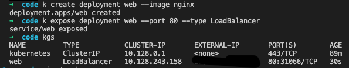

# Project Setup on LKE (Managed Kubernetes on Akamai Linode)

##0 - Prerequisites

- Linode account
- Domain name (to point to Linode DNS)
- Local CLI tools for k8s cluster management (kubectl, helm)

##1 - LKE Setup

Create a Kubernetes cluster in Linode with latest Kubernetes version (1.25 at the time of writing) with a single shared Linode 2GB node. This configuration will suffice for this test setup.

##2 - Setup LKE access in Local machine

```
export KUBECONFIG=$KUBECONFIG:~/PATH/TO/LKE/CONFIG
kubectl config view --raw >> ~/.kube/config.new
mv ~/.kube/config.new ~/.kube/config
unset KUBECONFIG
```

##3 - Install NGINX web server

```
k create deployment web --image nginx
k expose deployment web --port 80 --type LoadBalancer
```



##3.1 - `kubectl proxy` and `kubectl port-forward`

Run `kubectl proxy {PORT}` and access `web` nginx service with address
`http://localhost:{PORT}/api/v1/namespaces/default/services/web/proxy/`
