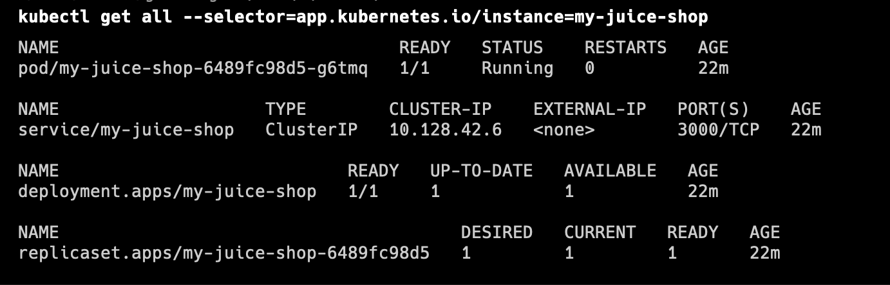

# Getting started with Helm

## Helm Chart search

`helm search hub owasp juice`

To see full part, output to `yaml` format

`helm search hub owasp juice -oyaml`


## Install Helm chart

- Add Chart repo for OWASP Juice Shop

```helm repo add juice https://charts.securecodebox.io```

- Install chart

```helm install my-juice-shop juice/juice-shop```

## Check Helm & Kubernetes 

- Show Helm releases
`helm list`

- Show all k8s resources created by helm
`kubectl get all --selector=app.kubernetes.io/instance=my-juice-shop`



## Update Helm release

Update value of service type from `ClusterIP` to `NodePort`

```helm upgrade my-juice-shop juice/juice-shop --set service.type=NodePort```
