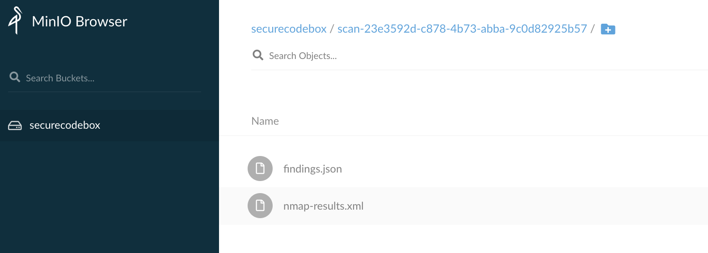

# OWASP SecureBox

## Installation

Follow instruction on 

## Access MinIO instance for Scan Reports

- Port forward MinIO UI:

```
kubectl port-forward -n securecodebox-system service/securecodebox-operator-minio 9000:9001
```

AccessKey:
```
kubectl get secret securecodebox-operator-minio -n securecodebox-system -o=jsonpath='{.data.accesskey}' | base64 --decode; echo
```

SecretKey:
```
kubectl get secret securecodebox-operator-minio -n securecodebox-system -o=jsonpath='{.data.secretkey}' | base64 --decode; echo
```

## First Scan (Nmap Port )
- Install Nmap

`helm install nmap secureCodeBox/nmap`

- Check installed scantypes
`kubectl get scantypes`

- Check Scans is complete
`kubectl get scans`
`kubectl get jobs`

- Check scan reports in MinIO

